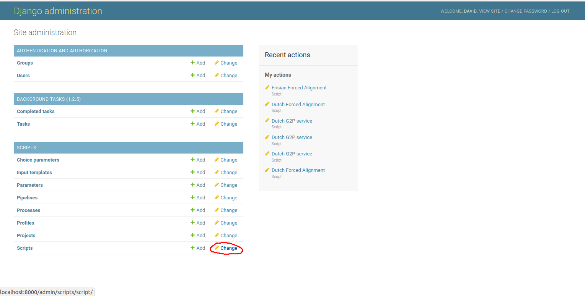
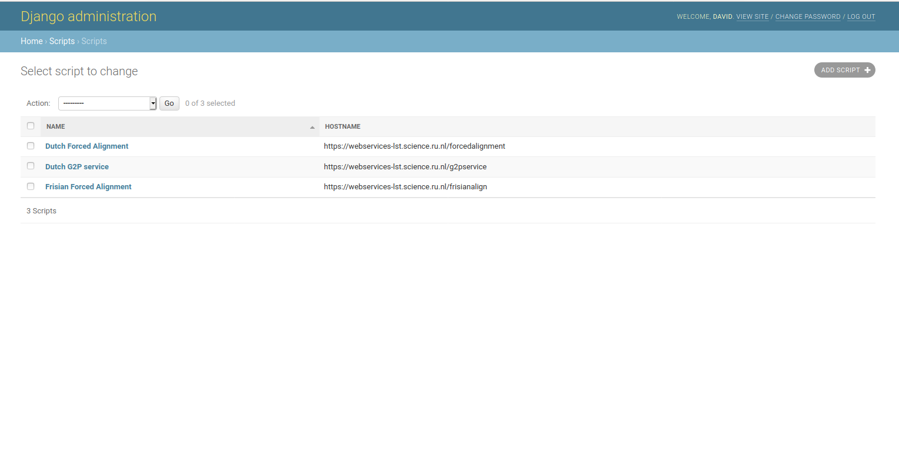
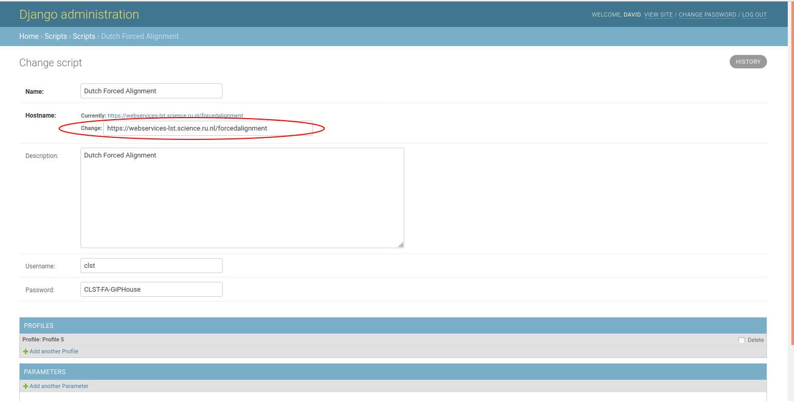

to change the address of an already existing CLAM server, go to the admin page, and click 'change' next to the Scripts header at the bottom of the page:

Then, click the script of the CLAM server you want to change:

Finally, change the address in the hostname box to the correct address:

