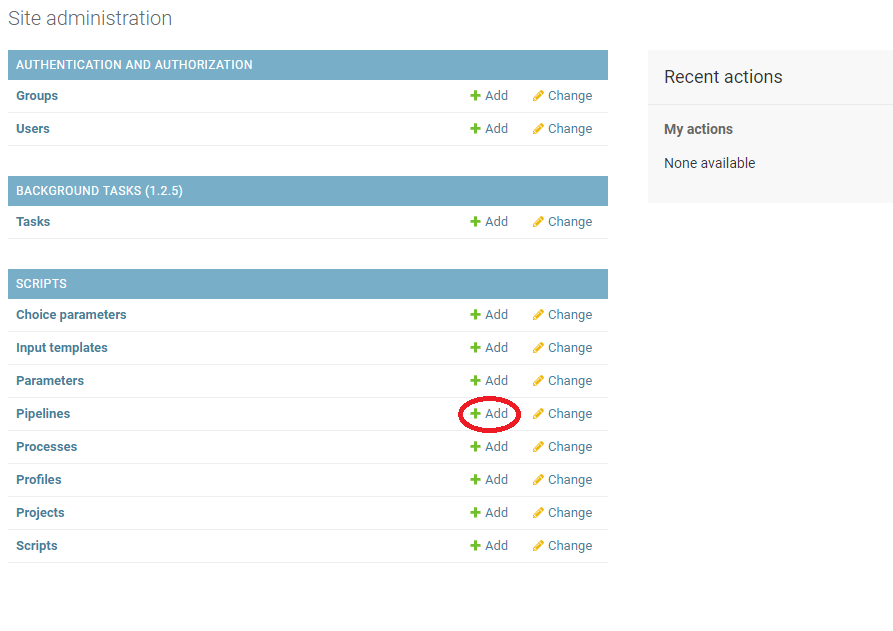
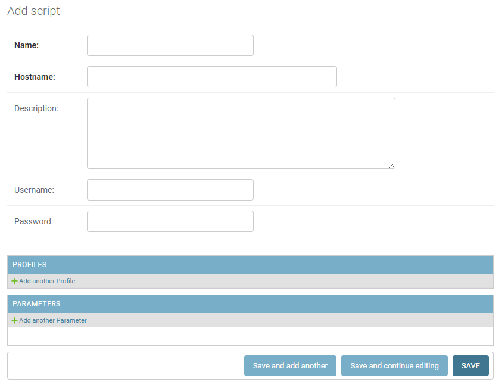

You can access the admininstrative section of equestria either by going to equestria.ru.nl/admin or clicking the "Site Admin" item in the dropdown menu of the user icon. Now, click the "add" button at Pipelines under Scripts: 

Here, you can name the new language and add the scripts by clicking the "add another script" button. A new window will open, which will look like this: 

You can use the same information for both of the types of scripts. 

In this window you can give a name to the script. It also requires a hostname. This could be a link to webservices-lst.science.ru.nl/<newlanguage>. You can add a description to the language to add clarification. There's also a Username and a Password field. These credentials are the same ones you use to log into the CLAM server. 

After you're done adding the information for the scripts, you click "save" and the window will close. 
Now, you can hit "save" in the "add pipeline" page and the new language is added. 
