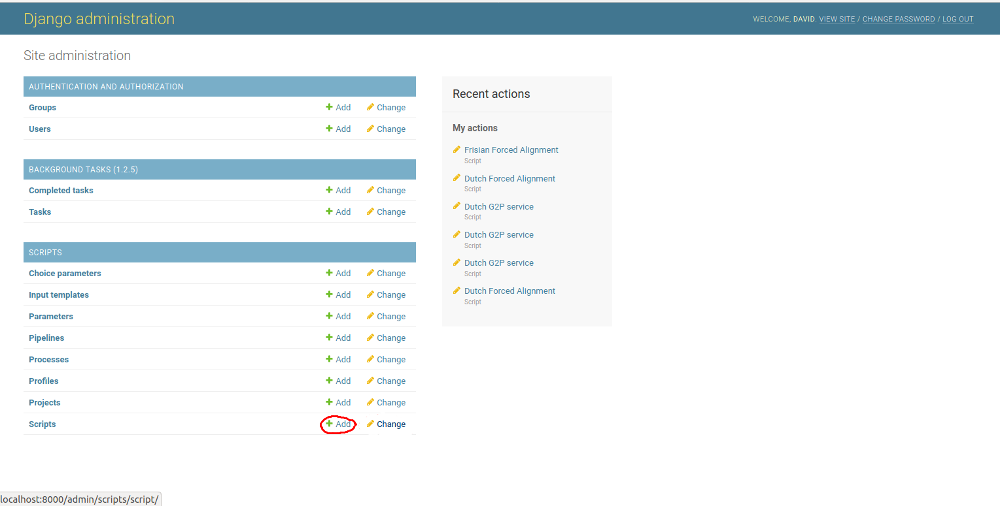
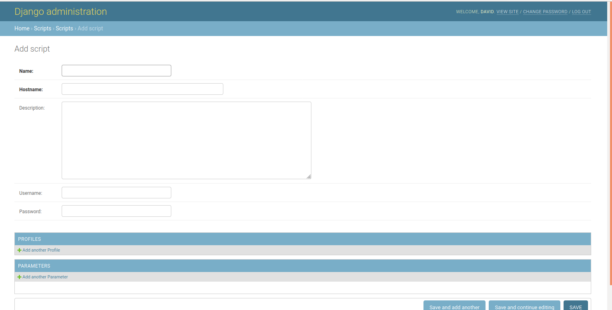

To create a new CLAM server, go to the admin page, and click '+ Add' next to the Scripts header:

Now put in a (fitting) title, put the location of the clam server in hostname, possibly add a description, and make sure you put in the username and password!

Lastly, click SAVE to create the script linking the site and the clam server.
